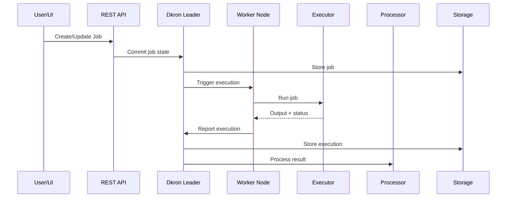
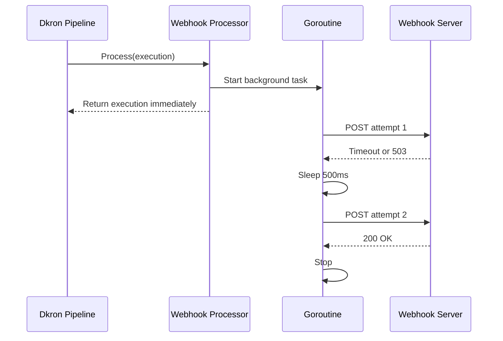

# BÁO CÁO BÀI TẬP LỚN GIỮA KỲ: HỆ THỐNG PHÂN TÁN

**Đề tài:** Tìm hiểu, cấu hình và phát triển mở rộng hệ thống lập lịch phân tán Dkron (Distributed Job Scheduler)

**Dự án gốc:** `https://github.com/dkron-io/dkron.git`

**Mã nguồn nhóm:** [bachiep/phan-tan-dkron-giuaky](https://github.com/bachiep/phan-tan-dkron-giuaky)

**Môn học:** Ứng dụng phân tán

**Nhóm thực hiện:** 2 thành viên

---

## MỤC LỤC

1. Lời mở đầu và định hướng báo cáo
2. Tổng quan dự án Dkron và phạm vi phân tích
3. Cài đặt, triển khai và khảo sát hệ thống gốc
4. Phương pháp tiếp cận và định hướng cải tiến
5. Tính năng cải tiến 1: Analytics API
6. Tính năng cải tiến 2: Webhook Processor Plugin
7. Kiểm thử và thực nghiệm
8. Tổng kết, phân công và hướng phát triển
9. Tài liệu tham khảo
10. Phụ lục

---

## CHƯƠNG 1: LỜI MỞ ĐẦU VÀ PHẠM VI BÁO CÁO

### 1.1. Bối cảnh

Trong các hệ thống phía máy chủ hiện đại, việc thực thi các tác vụ theo lịch là nhu cầu rất phổ biến. Một hệ thống có thể cần chạy các công việc như đồng bộ dữ liệu, gửi email định kỳ, tạo báo cáo, dọn dẹp log, gọi API đối tác, kiểm tra sức khỏe hệ thống hoặc xử lý dữ liệu nền. Với một máy chủ đơn lẻ, công cụ `cron` truyền thống có thể đáp ứng tốt. Tuy nhiên, khi hệ thống mở rộng thành nhiều máy chủ hoặc nhiều dịch vụ, `cron` truyền thống bộc lộ hạn chế lớn.

Hạn chế quan trọng nhất là **điểm lỗi duy nhất** (Single Point of Failure - SPOF). Nếu lịch chạy job chỉ nằm trên một máy chủ, khi máy chủ đó lỗi thì toàn bộ tác vụ nền sẽ dừng. Ngoài ra, `cron` truyền thống không có cơ chế bầu leader, không có đồng thuận, không tự phát hiện node lỗi, không đồng bộ trạng thái job giữa nhiều node và không có giao diện quản trị phân tán.

Dkron là một dự án mã nguồn mở giải quyết bài toán này bằng cách xây dựng một hệ thống lập lịch công việc phân tán. Dkron dùng Raft để đồng thuận và bầu leader, dùng Serf/Gossip để quản lý membership, cung cấp REST API, UI và kiến trúc plugin để mở rộng executor/processor.

### 1.2. Phạm vi và trọng tâm báo cáo

Báo cáo không đặt mục tiêu phân tích toàn bộ mã nguồn Dkron ở mức chi tiết từng thành phần, vì Dkron là một dự án có quy mô tương đối lớn, bao gồm nhiều lớp kỹ thuật như Raft, Serf, scheduler, storage, gRPC, REST API, giao diện quản trị và hệ thống plugin. Việc trình bày toàn bộ dự án ở mức chi tiết dòng mã sẽ làm báo cáo bị dàn trải, trong khi yêu cầu chính của bài tập là tìm hiểu, cài đặt, thực nghiệm và phát triển thêm chức năng mới trên nền một hệ thống phân tán có sẵn.

Do đó, báo cáo được tổ chức theo hướng tập trung vào các nội dung sau:

- Trình bày tổng quan Dkron ở mức cần thiết để hiểu bối cảnh hệ thống.
- Phân tích các thành phần có liên quan trực tiếp đến phần mở rộng.
- Tập trung vào hai chức năng cải tiến được phát triển trong phạm vi bài tập.
- Làm rõ mối liên hệ giữa các chức năng cải tiến với các vấn đề của hệ phân tán.
- Trình bày thiết kế, mã nguồn, kiểm thử và thực nghiệm đối với phần được phát triển bổ sung.

Dkron vì vậy được xem là **nền tảng hệ phân tán được lựa chọn để nghiên cứu và mở rộng**. Trọng tâm học thuật của báo cáo nằm ở việc phân tích cách hệ thống gốc hỗ trợ mở rộng, đồng thời đánh giá hai chức năng mới dưới góc nhìn vận hành và xử lý lỗi trong môi trường phân tán.

### 1.3. Hai chức năng được phát triển bổ sung

Trong phạm vi đề tài, hai chức năng được phát triển bổ sung gồm:

1. **Analytics API**
   - Bổ sung endpoint `/v1/analytics`.
   - Tổng hợp số job, số execution, tỷ lệ thành công và thời gian chạy trung bình.
   - Tối ưu việc đọc execution bằng BuntDB prefix scan thay vì truy vấn lặp theo từng job.
   - Tích hợp hiển thị trên bảng điều khiển quản trị.

2. **Webhook Processor Plugin**
   - Bổ sung processor plugin gửi HTTP POST khi job hoàn thành.
   - Gửi payload gồm job name, trạng thái, node chạy, output và thời gian.
   - Dùng goroutine để xử lý bất đồng bộ.
   - Dùng timeout và retry exponential backoff để tăng độ tin cậy khi gọi dịch vụ bên ngoài.

### 1.4. Yêu cầu bài tập và cách nhóm đáp ứng

Theo hướng dẫn bài tập lớn giữa kỳ, nhóm cần:

- Chọn một dự án mã nguồn mở thuộc lĩnh vực hệ phân tán.
- Tìm hiểu, cài đặt và thực nghiệm dự án.
- Phát triển 2 tính năng mới liên quan đến xử lý phân tán.
- Quản lý mã nguồn trên GitHub.
- Viết báo cáo và trình bày đóng góp từng thành viên.

Báo cáo này đáp ứng các yêu cầu trên bằng cách:

- Chọn Dkron, một hệ thống lập lịch phân tán thực tế.
- Cài đặt cụm 3 node bằng Docker Compose.
- Khảo sát các thành phần liên quan: Raft, Serf, scheduler, API, storage, plugin.
- Phát triển Analytics API và Webhook Processor Plugin.
- Có kiểm thử tự động cho các tính năng mới.
- Có kịch bản thực nghiệm leader failover để minh họa tính chịu lỗi của cụm.

---

## CHƯƠNG 2: TỔNG QUAN DỰ ÁN DKRON VÀ PHẠM VI PHÂN TÍCH

### 2.1. Dkron là gì?

Dkron là một hệ thống lập lịch công việc phân tán, có thể xem là phiên bản phân tán của `cron`. Thay vì đặt lịch chạy job trên một máy chủ duy nhất, Dkron cho phép chạy một cụm nhiều node. Các node phối hợp với nhau để lưu trạng thái job, bầu leader, phát hiện node lỗi và điều phối job.

Dkron được viết bằng Go. Đây là lựa chọn phù hợp cho hệ thống phân tán vì Go có runtime nhẹ, hỗ trợ concurrency tốt bằng goroutine, dễ viết dịch vụ mạng, dễ biên dịch thành binary độc lập và dễ đóng gói trong container.

Dkron có các đặc điểm chính:

- Lập lịch job theo cron expression hoặc cú pháp `@every`.
- Quản lý job qua REST API và UI.
- Chỉ leader điều phối job để tránh chạy trùng.
- Dùng Raft để đồng thuận và bầu leader.
- Dùng Serf/Gossip để quản lý membership.
- Hỗ trợ executor plugin để chạy nhiều loại job.
- Hỗ trợ processor plugin để xử lý kết quả job.

### 2.2. Sự phù hợp của Dkron với nội dung môn học

Dkron phù hợp với môn Ứng dụng phân tán vì hệ thống thể hiện nhiều khái niệm cốt lõi của lĩnh vực hệ phân tán trong một dự án mã nguồn mở có thể cài đặt và kiểm chứng thực nghiệm:

| Khái niệm | Biểu hiện trong Dkron |
| --- | --- |
| Hệ phân tán nhiều node | Dkron cluster gồm nhiều server/agent |
| Membership | Serf/Gossip quản lý node tham gia/rời cụm |
| Failure detection | Node lỗi được phát hiện qua cơ chế membership |
| Leader election | Raft bầu leader |
| Consensus | Raft đảm bảo trạng thái commit khi đạt quorum |
| Replication | Log trạng thái được sao chép giữa server |
| Fault tolerance | Cụm 3 node chịu được lỗi 1 server khi còn quorum |
| RPC | gRPC dùng cho giao tiếp nội bộ |
| API service | Gin REST API quản trị job |
| Extensibility | Plugin executor/processor |

Dkron không chỉ được sử dụng như một ứng dụng mẫu để chạy thử, mà còn là nền tảng phù hợp để khảo sát cách một hệ thống phân tán thực tế được tổ chức và mở rộng bằng các chức năng mới.

### 2.3. Các thành phần liên quan đến phần cải tiến

Báo cáo tập trung vào các thành phần có liên quan trực tiếp đến hai tính năng mới:

| Thành phần | File/thư mục | Liên quan đến cải tiến |
| --- | --- | --- |
| HTTP API | `dkron/dkron/api.go` | Nơi đăng ký route `/v1/analytics` |
| Storage | `dkron/dkron/store.go` | Nơi lưu job/execution, dùng cho Analytics API |
| Execution model | `dkron/dkron/execution.go` | Dữ liệu đầu vào của Analytics và Webhook |
| Job model | `dkron/dkron/job.go` | Dữ liệu job cần thống kê |
| Giao diện quản trị | `dkron/ui/src/dashboard/` | Nơi hiển thị Analytics |
| Plugin system | `dkron/plugin/` | Nền tảng để thêm Webhook Processor |
| CLI plugin command | `dkron/cmd/` | Nơi đăng ký command cho plugin |

### 2.4. Luồng hoạt động cơ bản

Luồng hoạt động Dkron có thể tóm tắt như sau:

1. Người dùng tạo job qua UI hoặc REST API.
2. Dkron validate job và ghi trạng thái vào hệ thống.
3. Leader điều phối scheduler.
4. Khi đến lịch, leader chọn node để chạy job.
5. Node thực thi job thông qua executor.
6. Kết quả chạy job được ghi thành execution.
7. Processor xử lý output hoặc kết quả execution nếu được cấu hình.

Sơ đồ luồng tổng quát:



Analytics API khai thác dữ liệu job/execution trong storage. Webhook Processor can thiệp ở bước processor sau khi execution hoàn thành.

### 2.5. Raft, Serf và Quorum trong phạm vi báo cáo

Báo cáo chỉ trình bày Raft và Serf ở mức cần thiết để hiểu Dkron:

- **Raft** giúp cụm bầu leader và duy trì trạng thái nhất quán.
- **Serf/Gossip** giúp các node biết nhau và phát hiện node lỗi.
- **Quorum** quyết định số node tối thiểu để cụm còn hoạt động hợp lệ.

Với cụm 3 server:

```text
Quorum = floor(3 / 2) + 1 = 2
```

Do đó cụm có thể chịu lỗi 1 server mà vẫn còn quorum. Đây là cơ sở cho kịch bản thực nghiệm dừng leader ở Chương 7.

---

## CHƯƠNG 3: CÀI ĐẶT, TRIỂN KHAI VÀ KHẢO SÁT HỆ THỐNG GỐC

### 3.1. Môi trường triển khai

Môi trường đề xuất:

| Thành phần | Yêu cầu |
| --- | --- |
| Git | Clone và quản lý mã nguồn |
| Docker | Build và chạy container |
| Docker Compose | Chạy cụm nhiều node |
| Trình duyệt | Truy cập Dkron UI |
| Go | Chạy kiểm thử và build local nếu cần |

### 3.2. Cấu trúc thư mục chính

```text
.
├── docker-compose.yml
├── docs/
│   ├── BAO_CAO_GIUA_KY_DKRON.md
│   └── HƯỚNG DẪN LÀM BÀI TẬP LỚN GIỮA KỲ.md
└── dkron/
    ├── cmd/
    ├── dkron/
    ├── plugin/
    ├── ui/
    ├── builtin/
    ├── Dockerfile
    └── go.mod
```

### 3.3. Cấu hình cụm 3 node

File `docker-compose.yml` ở thư mục gốc tạo 3 service:

- `dkron-server-1`
- `dkron-server-2`
- `dkron-server-3`

Mỗi node chạy:

```bash
dkron agent --server \
  --bootstrap-expect=3 \
  --node-name=serverX \
  --join=dkron-server-1 \
  --join=dkron-server-2 \
  --join=dkron-server-3
```

Ý nghĩa:

| Tham số | Ý nghĩa |
| --- | --- |
| `agent` | Chạy Dkron agent |
| `--server` | Node tham gia vai trò server |
| `--bootstrap-expect=3` | Chờ đủ 3 server để bootstrap cụm |
| `--node-name=serverX` | Tên định danh của node |
| `--join` | Danh sách node để join cluster |

Port mapping:

| Node | Port host | Port container |
| --- | --- | --- |
| `dkron-server-1` | 8080 | 8080 |
| `dkron-server-2` | 8081 | 8080 |
| `dkron-server-3` | 8082 | 8080 |

### 3.4. Lệnh chạy hệ thống

Khởi động cụm:

```bash
docker compose up --build -d
```

Kiểm tra container:

```bash
docker compose ps
```

Xem log:

```bash
docker compose logs -f
```

Truy cập UI:

```text
http://localhost:8080/ui
http://localhost:8081/ui
http://localhost:8082/ui
```

### 3.5. Khảo sát API gốc

Kiểm tra health:

```bash
curl http://localhost:8080/health
```

Kiểm tra leader:

```bash
curl http://localhost:8080/v1/leader
```

Kiểm tra members:

```bash
curl http://localhost:8080/v1/members
```

Tạo job mẫu:

```bash
curl -X POST http://localhost:8080/v1/jobs \
  -H "Content-Type: application/json" \
  -d '{
    "name": "demo_shell_job",
    "schedule": "@every 1m",
    "executor": "shell",
    "executor_config": {
      "command": "date"
    }
  }'
```

Kiểm tra execution:

```bash
curl http://localhost:8080/v1/jobs/demo_shell_job/executions
```

### 3.6. Nhận xét sau khi khảo sát hệ thống gốc

Sau khi khảo sát Dkron, nhóm nhận thấy:

- Dkron đã có API quản lý job và execution.
- Dkron đã có bảng điều khiển quản trị, nhưng chưa có một API tổng hợp nhanh các chỉ số toàn cục theo hướng nhóm mong muốn.
- Dkron có plugin processor nhưng chưa có processor webhook riêng theo thiết kế bất đồng bộ/retry của nhóm.
- Dkron phù hợp để mở rộng vì đã có sẵn cấu trúc API, storage và plugin rõ ràng.

Từ đó, nhóm chọn cải tiến theo hướng tăng khả năng quan sát hệ thống và tăng khả năng tích hợp với hệ thống giám sát bên ngoài.

---

## CHƯƠNG 4: PHƯƠNG PHÁP TIẾP CẬN VÀ ĐỊNH HƯỚNG CẢI TIẾN

### 4.1. Cơ sở lựa chọn hướng cải tiến

Một hệ thống phân tán không chỉ cần đảm bảo khả năng thực thi chức năng chính, mà còn cần có khả năng quan sát trạng thái và tích hợp với các hệ thống vận hành bên ngoài. Khi vận hành một cụm lập lịch công việc phân tán, quản trị viên thường cần trả lời các câu hỏi:

- Hệ thống hiện có bao nhiêu job?
- Job chạy thành công hay thất bại nhiều?
- Thời gian chạy trung bình có tăng bất thường không?
- Khi job thất bại, có thể gửi thông báo ra ngoài không?
- Nếu hệ thống giám sát bên ngoài chậm hoặc lỗi, Dkron có bị ảnh hưởng không?

Hai chức năng được phát triển trong đề tài xuất phát từ các nhu cầu trên:

- **Analytics API:** phục vụ quan sát trạng thái tổng thể.
- **Webhook Processor Plugin:** phục vụ tích hợp thông báo ra bên ngoài.

### 4.2. Mối liên hệ với hệ phân tán

Hai tính năng không thay đổi thuật toán Raft hay Serf của Dkron, nhưng vẫn liên quan trực tiếp đến hệ phân tán ở các điểm:

| Tính năng | Liên hệ với hệ phân tán |
| --- | --- |
| Analytics API | Tổng hợp dữ liệu job/execution của hệ thống lập lịch phân tán; tối ưu truy cập storage để tránh chi phí lặp; hỗ trợ quan sát trạng thái vận hành cluster |
| Webhook Processor | Gửi kết quả execution từ node/job ra hệ thống bên ngoài qua mạng; xử lý lỗi mạng bằng timeout/retry; dùng async để tránh gây chặn luồng xử lý chính |

Trong thực tế, các tính năng quan sát, cảnh báo và tích hợp là phần rất quan trọng của hệ phân tán. Một hệ thống phân tán khó vận hành nếu không có khả năng nhìn thấy trạng thái và phản ứng với sự cố.

### 4.3. Tiêu chí thiết kế

Các tiêu chí thiết kế được đặt ra như sau:

1. **Không phá vỡ hệ thống gốc**
   - Tính năng mới phải được thêm vào theo cấu trúc sẵn có.
   - Không thay đổi hành vi cốt lõi của scheduler, Raft hoặc Serf.

2. **Có liên hệ rõ với mã nguồn**
   - Chức năng mới được hiện thực trong các file mã nguồn cụ thể.
   - Có kiểm thử tự động để xác minh các logic chính.

3. **Có giá trị vận hành**
   - Analytics giúp quản trị viên nắm bắt trạng thái hệ thống nhanh hơn.
   - Webhook giúp kết nối với hệ thống giám sát/cảnh báo.

4. **Có xử lý tình huống lỗi**
   - Analytics có fallback nếu không dùng concrete store tối ưu.
   - Webhook có timeout, retry và chạy bất đồng bộ.

### 4.4. Tổng quan file thay đổi

| File | Thay đổi |
| --- | --- |
| `dkron/dkron/api_analytics.go` | Thêm handler Analytics API |
| `dkron/dkron/api.go` | Đăng ký route `/v1/analytics` |
| `dkron/dkron/api_analytics_test.go` | Thêm kiểm thử cho Analytics API |
| `dkron/ui/src/dashboard/AnalyticsStats.tsx` | Thêm thẻ hiển thị Analytics |
| `dkron/ui/src/dashboard/Dashboard.tsx` | Gắn thẻ Analytics vào bảng điều khiển |
| `dkron/plugin/webhook/webhook.go` | Thêm Webhook Processor |
| `dkron/plugin/webhook/webhook_test.go` | Thêm kiểm thử cho Webhook Processor |
| `dkron/cmd/webhook.go` | Đăng ký webhook plugin command |

---

## CHƯƠNG 5: TÍNH NĂNG CẢI TIẾN 1 - ANALYTICS API

### 5.1. Vấn đề cần giải quyết

Dkron đã cung cấp API lấy danh sách job và API truy vấn execution theo từng job. Tuy nhiên, để hiển thị các chỉ số tổng quan trên bảng điều khiển, phía client sẽ phải gọi nhiều API và tự tổng hợp dữ liệu. Quy trình này có thể mô tả như sau:

1. Gọi API lấy danh sách job.
2. Với từng job, gọi API lấy execution.
3. Tính tổng số execution.
4. Đếm số execution thành công.
5. Tính thời gian chạy trung bình.

Cách tiếp cận trên tồn tại một số hạn chế:

- Client phải thực hiện nhiều request.
- Logic tổng hợp bị đẩy ra UI hoặc hệ thống ngoài.
- Khi số job lớn, số request tăng theo số job.
- Bảng điều khiển khó hiển thị nhanh trạng thái tổng quan.

Vì vậy, một endpoint tổng hợp phía server được bổ sung:

```text
GET /v1/analytics
```

### 5.2. Mục tiêu chức năng

Analytics API được thiết kế để trả về các chỉ số sau:

| Trường | Ý nghĩa |
| --- | --- |
| `total_jobs` | Tổng số job trong hệ thống |
| `total_executions` | Tổng số execution đã ghi nhận |
| `success_rate` | Tỷ lệ execution thành công, giá trị 0 đến 1 |
| `average_duration_sec` | Thời gian chạy trung bình theo giây |

Response mẫu:

```json
{
  "total_jobs": 1,
  "total_executions": 2,
  "success_rate": 0.5,
  "average_duration_sec": 3
}
```

### 5.3. Vị trí mã nguồn

File chính:

```text
dkron/dkron/api_analytics.go
```

Route được đăng ký trong:

```text
dkron/dkron/api.go
```

Component UI:

```text
dkron/ui/src/dashboard/AnalyticsStats.tsx
```

Test:

```text
dkron/dkron/api_analytics_test.go
```

### 5.4. Thiết kế response

Kết quả trả về được biểu diễn bằng cấu trúc dữ liệu:

```go
type AnalyticsResult struct {
    TotalJobs          int     `json:"total_jobs"`
    TotalExecutions    int     `json:"total_executions"`
    SuccessRate        float64 `json:"success_rate"`
    AverageDurationSec float64 `json:"average_duration_sec"`
}
```

Các trường JSON sử dụng định dạng `snake_case`, phù hợp với cách đặt tên phổ biến trong REST API. Trường `success_rate` được biểu diễn trong khoảng từ 0 đến 1, giúp giá trị trả về có ý nghĩa rõ ràng về mặt tính toán; giao diện người dùng có thể nhân với 100 khi cần hiển thị dưới dạng phần trăm.

### 5.5. Vấn đề N+1 query

Cách triển khai trực tiếp nhất để tính toán analytics là:

```go
jobs := Store.GetJobs()
for _, job := range jobs {
    execs := Store.GetExecutions(job.Name)
    allExecs = append(allExecs, execs...)
}
```

Nếu hệ thống có `N` job, API phải gọi `GetExecutions()` `N` lần. Đây là dạng N+1 query. Khi số job tăng, API có thể chậm hơn vì phải lặp nhiều lần qua storage interface.

Trong hệ phân tán, các API quan sát trạng thái thường được gọi thường xuyên bởi bảng điều khiển hoặc hệ thống giám sát. Vì vậy, giảm số lần truy cập lặp là hướng cải tiến hợp lý.

### 5.6. Giải pháp của nhóm: Prefix Scan

Trong Dkron, execution được lưu trong storage theo key có tiền tố xác định. Khi storage hiện tại là concrete type `*Store`, có thể sử dụng phương thức nội bộ để quét toàn bộ execution trong một lần:

```go
if localStore, ok := h.agent.Store.(*Store); ok {
    kvs, err := localStore.list(executionsPrefix+":", false, &ExecutionOptions{})
    if err == nil {
        execs, _ = localStore.unmarshalExecutions(kvs, nil)
    }
}
```

Các kỹ thuật chính:

- **Type assertion:** kiểm tra storage interface có phải `*Store`.
- **Prefix scan:** lấy toàn bộ execution bằng prefix key.
- **In-memory aggregation:** tính toán chỉ số sau khi đã có danh sách execution.

So sánh:

| Cách làm | Đặc điểm |
| --- | --- |
| N+1 query | Lặp qua từng job và gọi `GetExecutions()` nhiều lần |
| Prefix scan | Quét execution một lần theo prefix rồi tổng hợp |

### 5.7. Fallback để tránh phụ thuộc quá mức

Vì `h.agent.Store` là interface, không nên bắt buộc mọi storage đều phải là `*Store`. Nếu type assertion không thành công hoặc không lấy được execution bằng prefix scan, API fallback về cách truyền thống:

```go
if execs == nil {
    for _, job := range jobs {
        jExecs, err := h.agent.Store.GetExecutions(
            c.Request.Context(),
            job.Name,
            &ExecutionOptions{},
        )
        if err == nil {
            execs = append(execs, jExecs...)
        }
    }
}
```

Điểm quan trọng là tính năng mới vừa có đường tối ưu, vừa không phá vỡ tính tương thích.

### 5.8. Công thức tính toán

Sau khi có `jobs` và `execs`, API tính:

```go
totalExecutions := len(execs)
successCount := 0
totalDuration := time.Duration(0)

for _, ex := range execs {
    if ex.Success {
        successCount++
    }
    if !ex.FinishedAt.IsZero() && !ex.StartedAt.IsZero() {
        totalDuration += ex.FinishedAt.Sub(ex.StartedAt)
    }
}
```

Công thức:

```text
success_rate = success_count / total_executions
average_duration_sec = total_duration_seconds / total_executions
```

Nếu chưa có execution:

```text
success_rate = 0
average_duration_sec = 0
```

Cách xử lý này tránh lỗi chia cho 0.

### 5.9. Đăng ký endpoint

Trong `dkron/dkron/api.go`, nhóm thêm:

```go
v1.GET("/analytics", h.analyticsHandler)
```

Endpoint nằm trong nhóm API `/v1`, cùng cấp với các endpoint như `/jobs`, `/members`, `/leader`, `/stats`.

### 5.10. Tích hợp giao diện quản trị

Component `AnalyticsStats.tsx` gọi:

```tsx
fetch('/v1/analytics')
```

Sau đó hiển thị:

- Tỷ lệ thành công.
- Thời gian chạy trung bình.

Trong `Dashboard.tsx`, component được thêm vào vùng hiển thị thống kê để người dùng thấy ngay các chỉ số khi mở bảng điều khiển.

### 5.11. Kiểm thử

Test: `TestAPIAnalytics`

Kịch bản:

1. Khởi tạo API server phục vụ kiểm thử.
2. Tạo job `test_analytics_job`.
3. Tạo execution thành công duration 2 giây.
4. Tạo execution thất bại duration 4 giây.
5. Gọi `/v1/analytics`.
6. Kiểm tra kết quả:
   - `total_jobs >= 1`
   - `total_executions = 2`
   - `success_rate = 0.5`
   - `average_duration_sec = 3.0`

Trong quá trình kiểm thử, nhóm phát hiện một lỗi ẩn trong kịch bản kiểm thử ban đầu: hai execution cùng dùng một `StartedAt` và cùng `NodeName`, trong khi key lưu execution của BuntDB phụ thuộc vào thời điểm bắt đầu và node thực thi. Vì vậy execution thứ hai có thể ghi đè execution thứ nhất, làm API chỉ đếm được 1 execution. Nhóm đã sửa kịch bản kiểm thử bằng cách cho execution thứ hai dùng `StartedAt` lệch 1 millisecond và `NodeName` khác, bảo đảm hai bản ghi execution có key riêng.

Lệnh chạy:

```bash
go test ./dkron -run TestAPIAnalytics -count=1
```

### 5.12. Giá trị của cải tiến

Analytics API giúp:

- Dashboard không cần tự tổng hợp qua nhiều request.
- Người quản trị nắm nhanh tình trạng hệ thống.
- Hệ thống có thêm endpoint quan sát toàn cục.
- Giảm chi phí đọc lặp khi storage là BuntDB `*Store`.

Đây là cải tiến theo hướng vận hành hệ phân tán: quan sát trạng thái, giảm chi phí tổng hợp và cung cấp dữ liệu trực tiếp cho UI/monitoring.

### 5.13. Hạn chế và hướng nâng cấp

Hạn chế:

- Chưa có bộ lọc theo khoảng thời gian.
- Chưa thống kê theo từng job hoặc từng node.
- Chưa có P95/P99 duration.
- Chưa có benchmark chính thức với dữ liệu lớn.
- Prefix scan phụ thuộc vào implementation nội bộ của `*Store`.

Hướng nâng cấp:

- Thêm query parameter `from`, `to`, `job`, `node`.
- Thêm cache ngắn hạn cho bảng điều khiển.
- Thêm benchmark so sánh N+1 và prefix scan.
- Thêm biểu đồ execution theo ngày.

---

## CHƯƠNG 6: TÍNH NĂNG CẢI TIẾN 2 - WEBHOOK PROCESSOR PLUGIN

### 6.1. Vấn đề cần giải quyết

Trong thực tế, khi một job hoàn thành, hệ thống thường cần gửi kết quả đến nơi khác:

- Bảng điều khiển giám sát.
- Alerting service.
- ChatOps bot.
- Incident management system.
- Audit/log service.

Dkron có plugin processor để xử lý output sau khi job chạy xong. Nhóm tận dụng cơ chế này để thêm Webhook Processor Plugin.

Mục tiêu của chức năng là gửi một HTTP POST chứa thông tin execution đến URL được cấu hình sau khi job hoàn thành.

### 6.2. Vị trí mã nguồn

| File | Vai trò |
| --- | --- |
| `dkron/plugin/webhook/webhook.go` | Hiện thực processor |
| `dkron/plugin/webhook/webhook_test.go` | Kiểm thử processor |
| `dkron/cmd/webhook.go` | Đăng ký plugin command |

### 6.3. Thiết kế cấu hình

Plugin đọc URL từ config:

```go
url, ok := args.Config["webhook_url"]
if !ok || url == "" {
    return args.Execution
}
```

Nếu không có `webhook_url`, plugin không thực hiện xử lý bổ sung và trả execution về nguyên trạng. Cách xử lý này giúp plugin an toàn trong trường hợp cấu hình thiếu hoặc chưa được kích hoạt.

### 6.4. Payload gửi đến webhook receiver

Payload gồm:

| Trường | Ý nghĩa |
| --- | --- |
| `job_name` | Tên job |
| `success` | Execution thành công hay thất bại |
| `node_name` | Node thực thi job |
| `output` | Output của job |
| `started_at` | Thời điểm bắt đầu |
| `finished_at` | Thời điểm kết thúc |

Mã nguồn:

```go
payload := map[string]interface{}{
    "job_name":  args.Execution.JobName,
    "success":   args.Execution.Success,
    "node_name": args.Execution.NodeName,
    "output":    string(args.Execution.Output),
}
```

Timestamp được thêm nếu tồn tại:

```go
if args.Execution.StartedAt != nil {
    payload["started_at"] = args.Execution.StartedAt.AsTime().Format(time.RFC3339)
}
if args.Execution.FinishedAt != nil {
    payload["finished_at"] = args.Execution.FinishedAt.AsTime().Format(time.RFC3339)
}
```

Response gửi đi có dạng:

```json
{
  "job_name": "backup_database",
  "success": true,
  "node_name": "server2",
  "output": "backup completed",
  "started_at": "2026-06-02T10:00:00Z",
  "finished_at": "2026-06-02T10:00:03Z"
}
```

### 6.5. Vì sao cần bất đồng bộ?

Nếu gửi webhook đồng bộ, Dkron phải chờ webhook server phản hồi. Trong hệ phân tán, request mạng có thể chậm hoặc lỗi. Nếu endpoint giám sát bị treo, pipeline xử lý execution cũng bị kéo dài.

Việc gửi webhook được đưa vào một goroutine:

```go
go func() {
    // send webhook in background
}()
```

Thiết kế này mang lại các lợi ích:

- `Process()` trả về nhanh.
- Việc gửi webhook không chặn pipeline chính.
- Job scheduler ít bị ảnh hưởng bởi độ trễ của hệ thống bên ngoài.

Đây là cải tiến quan trọng vì nó tách độ trễ của hệ thống bên ngoài khỏi luồng xử lý chính của Dkron.

### 6.6. Timeout và retry

Plugin tạo HTTP client có timeout:

```go
client := &http.Client{Timeout: 3 * time.Second}
```

Nếu request không hoàn thành trong 3 giây, client timeout. Điều này tránh việc goroutine chờ vô hạn.

Plugin retry tối đa 3 lần:

```go
maxRetries := 3
backoff := 500 * time.Millisecond
```

Sau mỗi lần thất bại:

```go
time.Sleep(backoff)
backoff *= 2
```

Timeline:

| Attempt | Nếu thất bại thì chờ |
| --- | --- |
| 1 | 500ms |
| 2 | 1s |
| 3 | Dừng |

Nếu server trả status code 2xx:

```go
if resp.StatusCode >= 200 && resp.StatusCode < 300 {
    break
}
```

Plugin xem request là thành công và không thực hiện retry tiếp.

### 6.7. Sơ đồ hoạt động



### 6.8. Tích hợp với HashiCorp go-plugin

File `dkron/cmd/webhook.go` đăng ký plugin command:

```go
var webhookCmd = &cobra.Command{
    Hidden: true,
    Use:    "webhook",
    Short:  "Webhook processor plugin for dkron",
    Run: func(cmd *cobra.Command, args []string) {
        plugin.Serve(&plugin.ServeConfig{
            HandshakeConfig: dkplugin.Handshake,
            Plugins: map[string]plugin.Plugin{
                "processor": &dkplugin.ProcessorPlugin{
                    Processor: &webhook.Webhook{},
                },
            },
            GRPCServer: plugin.DefaultGRPCServer,
        })
    },
}
```

Điểm đáng chú ý là chức năng mới được tích hợp thông qua kiến trúc plugin sẵn có của Dkron, thay vì xây dựng một cơ chế mở rộng riêng biệt.

### 6.9. Kiểm thử

Test: `TestWebhookProcessor`

Kịch bản:

1. Tạo máy chủ HTTP giả lập bằng `httptest.NewServer`.
2. Tạo `Webhook` processor.
3. Tạo execution giả lập.
4. Cấu hình `webhook_url` là URL của máy chủ giả lập.
5. Gọi `Process()`.
6. Chờ goroutine gửi request.
7. Kiểm tra máy chủ giả lập nhận request.
8. Kiểm tra JSON payload đúng.

Test thiếu config: `TestWebhookProcessor_NoConfig`

Kịch bản:

1. Tạo execution.
2. Không truyền `webhook_url`.
3. Gọi `Process()`.
4. Kiểm tra execution trả về không đổi.

Lệnh chạy:

```bash
go test ./plugin/webhook -count=1
```

### 6.10. Giá trị của cải tiến

Webhook Processor giúp Dkron:

- Kết nối với hệ thống giám sát bên ngoài.
- Gửi thông tin execution theo thời gian gần thực.
- Không phụ thuộc đồng bộ vào webhook server.
- Có khả năng chịu lỗi mạng tạm thời nhờ retry.
- Có timeout để tránh treo request.

Trong môi trường phân tán, đây là cải tiến thực tế vì các thành phần thường giao tiếp qua mạng và phải xử lý lỗi mạng một cách phòng vệ.

### 6.11. Hạn chế và hướng nâng cấp

Hạn chế:

- Goroutine là fire-and-forget, nếu process chết giữa lúc retry thì webhook có thể mất.
- Chưa có persistent retry queue.
- Chưa có cấu hình động cho retry/timeout.
- Chưa có chữ ký HMAC để xác thực webhook.
- Chưa có metric riêng cho webhook success/failure.
- Chưa giới hạn kích thước output.

Hướng nâng cấp:

- Thêm cấu hình `max_retries`, `timeout`, `initial_backoff`.
- Thêm HMAC signature.
- Thêm queue lưu webhook chưa gửi thành công.
- Thêm metric Prometheus.
- Thêm bộ lọc để chỉ gửi webhook khi job thất bại hoặc thành công.

---

## CHƯƠNG 7: KIỂM THỬ VÀ THỰC NGHIỆM

### 7.1. Kiểm thử tự động cho tính năng mới

Kiểm thử tự động được bổ sung cho cả hai chức năng cải tiến:

| Test | File | Mục tiêu |
| --- | --- | --- |
| `TestAPIAnalytics` | `dkron/dkron/api_analytics_test.go` | Kiểm tra endpoint `/v1/analytics` tính đúng số job, execution, success rate và duration |
| `TestWebhookProcessor` | `dkron/plugin/webhook/webhook_test.go` | Kiểm tra webhook processor gửi HTTP POST đúng payload |
| `TestWebhookProcessor_NoConfig` | `dkron/plugin/webhook/webhook_test.go` | Kiểm tra thiếu config thì không làm thay đổi execution |

Lệnh chạy:

```bash
go test ./dkron -run TestAPIAnalytics -count=1
go test ./plugin/webhook -count=1
```

Do môi trường phát triển không có sẵn lệnh `go` trong PATH, quá trình kiểm thử được thực hiện bằng Docker image được build từ dự án:

```bash
docker run --rm -v "i:\Tài liệu đại học\Phân tánb\giuaKi\dkron:/app" -w /app giuaki-dkron-server-1:latest go test ./dkron -run TestAPIAnalytics -count=1
docker run --rm -v "i:\Tài liệu đại học\Phân tánb\giuaKi\dkron:/app" -w /app giuaki-dkron-server-1:latest go test ./plugin/webhook -count=1
```

Kết quả kiểm thử cho thấy cả hai nhóm kiểm thử đều đạt:

```text
ok github.com/distribworks/dkron/v4/dkron 3.557s
ok github.com/distribworks/dkron/v4/plugin/webhook 0.085s
```

Tiêu chí đạt:

- Kiểm thử Analytics trả status `200 OK`.
- JSON Analytics có giá trị đúng với dữ liệu kiểm thử.
- Kiểm thử Webhook nhận được request tại máy chủ giả lập.
- Payload Webhook có đúng `job_name`, `success`, `node_name`, `output`, `started_at`, `finished_at`.
- Khi thiếu `webhook_url`, processor không gửi request và không làm thay đổi execution.

### 7.2. Thực nghiệm khởi động cụm

Khởi động:

```bash
docker compose up --build -d
```

Kiểm tra:

```bash
docker compose ps
curl http://localhost:8080/v1/members
curl http://localhost:8080/v1/leader
```

Kết quả mong đợi:

- Có 3 container Dkron server chạy.
- API `/v1/members` trả về 3 node.
- API `/v1/leader` trả về một leader.
- UI truy cập được qua `/ui`.

### 7.3. Thực nghiệm Analytics API

Tạo job:

```bash
curl -X POST http://localhost:8080/v1/jobs \
  -H "Content-Type: application/json" \
  -d '{
    "name": "demo_shell_job",
    "schedule": "@every 1m",
    "executor": "shell",
    "executor_config": {
      "command": "date"
    }
  }'
```

Sau khi job chạy, gọi:

```bash
curl http://localhost:8080/v1/analytics
```

Kết quả mong đợi:

```json
{
  "total_jobs": 1,
  "total_executions": 1,
  "success_rate": 1,
  "average_duration_sec": 0.01
}
```

Giá trị thực tế phụ thuộc số job, số execution và thời gian chạy. Điều cần kiểm tra là:

- API trả `200 OK`.
- Có đủ 4 trường.
- `total_jobs` khớp số job.
- `total_executions` tăng khi job chạy thêm.
- `success_rate` nằm trong khoảng 0 đến 1.
- `average_duration_sec` không âm.

### 7.4. Thực nghiệm Webhook Processor

Kịch bản:

1. Khởi động webhook receiver hoặc máy chủ giả lập.
2. Cấu hình job dùng processor webhook với `webhook_url`.
3. Chạy job.
4. Quan sát receiver nhận HTTP POST.
5. Cho receiver trả lỗi tạm thời để kiểm tra retry.

Kết quả mong đợi:

- Receiver nhận payload JSON.
- Payload có job name, success, node name, output và timestamp.
- Khi endpoint lỗi, plugin retry tối đa 3 lần.
- Hàm `Process()` không bị chặn bởi webhook request.

### 7.5. Thực nghiệm leader failover

Mục tiêu của thực nghiệm này là xác minh nhóm đã cài đặt được cụm Dkron và hiểu cơ chế chịu lỗi cơ bản của hệ thống gốc. Thực nghiệm không nhằm chứng minh hai chức năng cải tiến thay đổi thuật toán Raft, mà nhằm minh họa bối cảnh phân tán nơi các chức năng cải tiến được triển khai.

Bước 1: xác định leader:

```bash
curl http://localhost:8080/v1/leader
```

Bước 2: dừng container leader:

```bash
docker stop <leader-container-name>
```

Bước 3: kiểm tra leader mới qua node còn lại:

```bash
curl http://localhost:8081/v1/leader
curl http://localhost:8082/v1/leader
```

Phân tích:

```text
N = 3
Quorum = floor(3 / 2) + 1 = 2
```

Khi 1 node lỗi, cụm còn 2 node hoạt động. Do vẫn đạt quorum, cụm có thể tiến hành bầu leader mới và tiếp tục vận hành sau quá trình failover. Kết quả này cho thấy cấu hình 3 server có khả năng chịu lỗi 1 server trong điều kiện vẫn còn quorum. Báo cáo không khẳng định hệ thống luôn không gián đoạn, vì quá trình chuyển leader vẫn phụ thuộc vào election timeout và điều kiện mạng tại thời điểm xảy ra lỗi.

### 7.6. Bảng tổng hợp kết quả

| Hạng mục | Kết quả |
| --- | --- |
| Cài đặt Dkron | Có Docker Compose cụm 3 server |
| Khảo sát hệ thống gốc | Có kiểm tra members, leader, jobs, executions |
| Cải tiến 1 | Analytics API `/v1/analytics` |
| Cải tiến 1 UI | Card Analytics trên Dashboard |
| Cải tiến 1 kiểm thử | `TestAPIAnalytics` |
| Cải tiến 2 | Webhook Processor Plugin |
| Cải tiến 2 kiểm thử | `TestWebhookProcessor`, `TestWebhookProcessor_NoConfig` |
| Thực nghiệm phân tán | Leader failover trong cụm 3 node |
| Hạn chế | Chưa có benchmark lớn, chưa có persistent retry queue |

---

## CHƯƠNG 8: TỔNG KẾT, PHÂN CÔNG VÀ HƯỚNG PHÁT TRIỂN

### 8.1. Kết quả đạt được

Nhóm đã:

- Tìm hiểu và cài đặt Dkron.
- Hiểu các thành phần phân tán chính ở mức cần thiết: Raft, Serf/Gossip, quorum, leader.
- Chạy cụm 3 node bằng Docker Compose.
- Phát triển Analytics API để tổng hợp chỉ số vận hành.
- Tối ưu Analytics API bằng prefix scan khi storage là `*Store`.
- Thêm fallback để API vẫn tương thích.
- Tích hợp Analytics vào giao diện quản trị.
- Phát triển Webhook Processor Plugin.
- Dùng goroutine để gửi webhook bất đồng bộ.
- Dùng timeout và exponential backoff để xử lý lỗi mạng tạm thời.
- Viết kiểm thử tự động cho 2 tính năng.

### 8.2. Đóng góp chính của báo cáo

Trọng tâm của báo cáo là phần cải tiến được phát triển trên nền Dkron, thay vì mô tả lại toàn bộ hệ thống gốc. Cụ thể:

- **Analytics API** cải thiện khả năng quan sát trạng thái hệ thống.
- **Webhook Processor** cải thiện khả năng tích hợp với hệ thống giám sát bên ngoài.
- Cả hai tính năng đều gắn với các vấn đề thực tế trong hệ phân tán: quan sát trạng thái, giao tiếp qua mạng, xử lý lỗi tạm thời, giảm trạng thái chặn và thiết kế phòng vệ.

### 8.3. Hạn chế

Hạn chế chung:

- Chưa có benchmark chính thức với số lượng job/execution lớn.
- Chưa có ảnh/log thực nghiệm được chèn trực tiếp vào báo cáo.
- Chưa kiểm thử cụm 5 node.
- Chưa tích hợp bảo mật cho endpoint mới.

Hạn chế Analytics:

- Chưa có bộ lọc theo thời gian/job/node.
- Chưa có biểu đồ chi tiết.
- Chưa có percentile duration.

Hạn chế Webhook:

- Chưa có persistent retry queue.
- Chưa có HMAC signature.
- Chưa có metric webhook riêng.
- Chưa cho cấu hình retry/timeout từ job config.

### 8.4. Hướng phát triển

Hướng phát triển Analytics:

- Thêm các bộ lọc `from`, `to`, `job`, `node`.
- Thêm biểu đồ execution theo ngày.
- Thêm thống kê job thất bại nhiều nhất.
- Thêm benchmark so sánh N+1 query và prefix scan.

Hướng phát triển Webhook:

- Thêm cấu hình `max_retries`, `timeout`, `backoff`.
- Thêm persistent queue để tránh mất webhook khi process chết.
- Thêm chữ ký HMAC.
- Thêm Prometheus metrics.
- Cho phép chỉ gửi webhook khi job thất bại.

Hướng phát triển hệ thống:

- Cải thiện tài liệu triển khai.
- Bổ sung ảnh chụp UI và log thực nghiệm.
- Thử nghiệm failover với cụm 5 node.
- Kiểm tra ảnh hưởng của tính năng mới khi có nhiều execution.

### 8.5. Phân công công việc

Phân công công việc của các thành viên trong nhóm được tổng hợp như sau:

| Thành viên | Công việc |
| --- | --- |
| Thành viên 1 - Họ tên: ... - MSSV: ... | Tìm hiểu Dkron, Raft, Serf/Gossip; cấu hình Docker Compose cụm 3 node; phát triển Analytics API; tối ưu prefix scan; tích hợp giao diện quản trị; viết kiểm thử `TestAPIAnalytics` |
| Thành viên 2 - Họ tên: ... - MSSV: ... | Tìm hiểu plugin architecture và HashiCorp go-plugin; phát triển Webhook Processor; hiện thực goroutine, timeout, retry exponential backoff; viết kiểm thử webhook; thực hiện thực nghiệm failover và tổng hợp báo cáo |

### 8.6. Kết luận

Dkron là một dự án phù hợp để nghiên cứu trong môn Ứng dụng phân tán vì hệ thống có cluster nhiều node, leader election, consensus, membership, API và plugin architecture. Trong phạm vi bài tập, nhóm không đi sâu toàn bộ mã nguồn Dkron mà tập trung vào việc hiểu các thành phần cần thiết để mở rộng hệ thống.

Hai cải tiến được phát triển có ý nghĩa thực tế trong vận hành hệ phân tán. Analytics API giúp quan sát trạng thái tổng thể của job scheduler, còn Webhook Processor giúp gửi kết quả job ra hệ thống bên ngoài theo cách bất đồng bộ và có retry. Qua đó, nhóm thể hiện được quá trình tìm hiểu dự án gốc, cài đặt thực nghiệm và bổ sung chức năng mới dựa trên kiến trúc có sẵn.

---

## CHƯƠNG 9: TÀI LIỆU THAM KHẢO

1. Dkron GitHub Repository: `https://github.com/dkron-io/dkron`
2. Dkron Documentation: `https://dkron.io/docs`
3. HashiCorp Raft: `https://github.com/hashicorp/raft`
4. HashiCorp Serf: `https://www.serf.io/`
5. HashiCorp go-plugin: `https://github.com/hashicorp/go-plugin`
6. BuntDB: `https://github.com/tidwall/buntdb`
7. Gin Web Framework: `https://github.com/gin-gonic/gin`
8. Go Programming Language: `https://go.dev/`
9. Reliable Cron across the Planet: `https://queue.acm.org/detail.cfm?id=2745840`
10. Docker Compose Documentation: `https://docs.docker.com/compose/`

---

## PHỤ LỤC A: LỆNH THỰC NGHIỆM

Khởi động cụm:

```bash
docker compose up --build -d
```

Xem container:

```bash
docker compose ps
```

Xem log:

```bash
docker compose logs -f
```

Kiểm tra health:

```bash
curl http://localhost:8080/health
```

Kiểm tra leader:

```bash
curl http://localhost:8080/v1/leader
```

Kiểm tra members:

```bash
curl http://localhost:8080/v1/members
```

Tạo job:

```bash
curl -X POST http://localhost:8080/v1/jobs \
  -H "Content-Type: application/json" \
  -d '{
    "name": "demo_shell_job",
    "schedule": "@every 1m",
    "executor": "shell",
    "executor_config": {
      "command": "date"
    }
  }'
```

Gọi Analytics API:

```bash
curl http://localhost:8080/v1/analytics
```

Dừng leader:

```bash
docker stop <leader-container-name>
```

Chạy kiểm thử:

```bash
go test ./dkron -run TestAPIAnalytics -count=1
go test ./plugin/webhook -count=1
```

Chạy kiểm thử bằng Docker khi máy không có Go trong PATH:

```bash
docker run --rm -v "i:\Tài liệu đại học\Phân tánb\giuaKi\dkron:/app" -w /app giuaki-dkron-server-1:latest go test ./dkron -run TestAPIAnalytics -count=1
docker run --rm -v "i:\Tài liệu đại học\Phân tánb\giuaKi\dkron:/app" -w /app giuaki-dkron-server-1:latest go test ./plugin/webhook -count=1
```

---

## PHỤ LỤC B: DANH MỤC MINH CHỨNG THỰC NGHIỆM

Khi xuất bản báo cáo chính thức hoặc chuẩn bị slide thuyết trình, các minh chứng sau có thể được bổ sung để tăng tính thuyết phục cho phần thực nghiệm:

1. Ảnh chụp giao diện Dashboard hiển thị thẻ Analytics.
2. Kết quả gọi API `GET /v1/analytics`.
3. Kết quả gọi API `GET /v1/leader` trước và sau khi dừng leader.
4. Log Docker Compose thể hiện cụm Dkron khởi động và các node tham gia cluster.
5. Kết quả kiểm thử tự động cho `TestAPIAnalytics`.
6. Kết quả kiểm thử tự động cho `TestWebhookProcessor` và `TestWebhookProcessor_NoConfig`.
7. Lịch sử commit trên GitHub thể hiện quá trình phát triển và chỉnh sửa mã nguồn.

Các minh chứng trên không thay thế phần phân tích trong báo cáo, nhưng giúp xác nhận rằng quá trình cài đặt, kiểm thử và thực nghiệm đã được thực hiện trên hệ thống thực tế.
