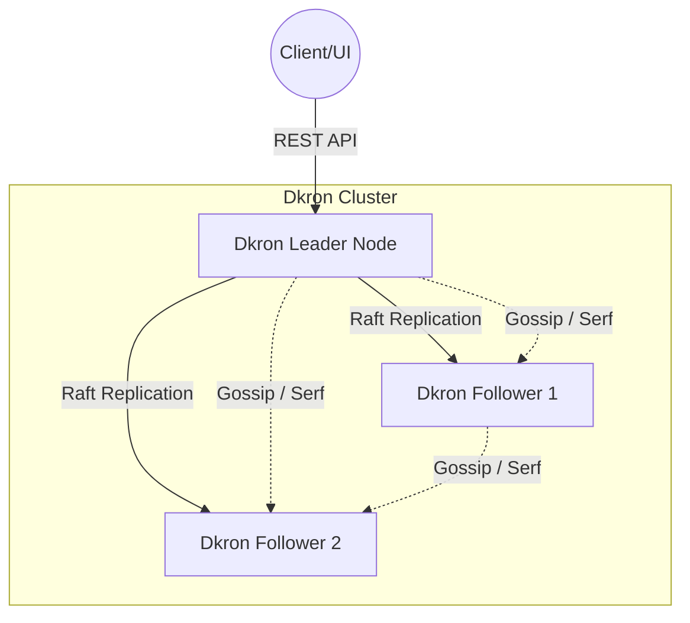
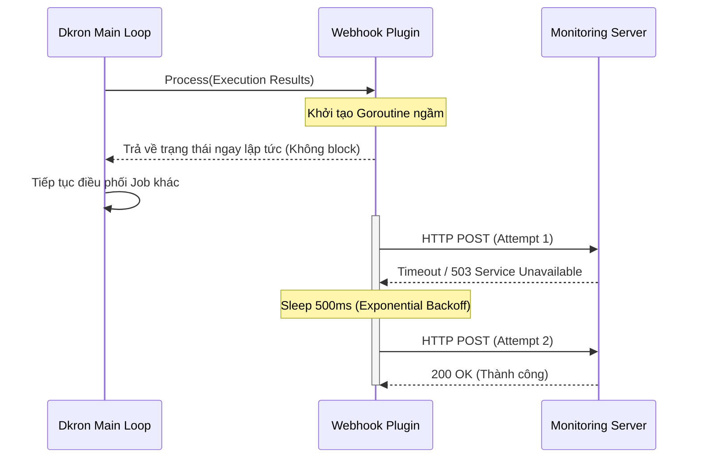

# BÁO CÁO BÀI TẬP LỚN GIỮA KỲ: HỆ THỐNG PHÂN TÁN
**Đề tài:** Tìm hiểu, cấu hình và phát triển mở rộng hệ thống lập lịch phân tán Dkron (Distributed Job Scheduler)

**Mã nguồn lưu trữ:** `https://github.com/bachiep/phan-tan-dkron-giuaky.git`

---

## LỜI MỞ ĐẦU
Trong kỷ nguyên Điện toán đám mây (Cloud Computing) và Kiến trúc vi dịch vụ (Microservices), các hệ thống phần mềm ngày càng trở nên phức tạp và phải xử lý khối lượng công việc khổng lồ. Một trong những thành phần không thể thiếu trong bất kỳ hệ thống backend nào là hệ thống lập lịch tác vụ (Job Scheduler) nhằm thực thi các công việc nền (background jobs) như: đồng bộ dữ liệu, dọn dẹp cơ sở dữ liệu, gửi email hàng loạt, hay huấn luyện mô hình học máy. 

Theo truyền thống, các kĩ sư thường sử dụng công cụ `cron` tích hợp sẵn trên hệ điều hành Linux. Mặc dù đơn giản và hiệu quả, `cron` truyền thống mang trong mình một điểm yếu chí mạng đối với các hệ thống quy mô lớn: **Rủi ro Điểm lỗi duy nhất (Single Point of Failure - SPOF)**. Nếu máy chủ vật lý chứa tiến trình `cron` gặp sự cố (cúp điện, lỗi phần cứng, mất kết nối mạng), toàn bộ hệ thống tác vụ nền sẽ tê liệt hoàn toàn. 

Để giải quyết bài toán này, các **Hệ thống Lập lịch Phân tán (Distributed Job Schedulers)** đã ra đời. Báo cáo này tập trung vào việc nghiên cứu, cài đặt thực nghiệm hệ thống mã nguồn mở **Dkron**, đồng thời đi sâu vào việc tự thiết kế và phát triển thêm hai module phân tán nâng cao nhằm nâng cao khả năng giám sát và độ tin cậy của hệ thống.

---

## CHƯƠNG 1: TỔNG QUAN VÀ KIẾN TRÚC HỆ THỐNG DKRON

### 1.1. Dkron là gì?
Dkron là một hệ thống lên lịch công việc phân tán, linh hoạt và có khả năng chịu lỗi cực cao (Fault-tolerant). Dkron được viết hoàn toàn bằng ngôn ngữ Go (Golang), tận dụng ưu điểm xử lý đồng thời (Concurrency) ưu việt của Go. Hệ thống này có thể được triển khai dưới dạng một cụm (cluster) gồm nhiều máy chủ (nodes) hoạt động song song.

### 1.2. Các Giao thức Phân tán Cốt lõi
Kiến trúc của Dkron là sự kết hợp hoàn hảo của hai giao thức mạng phân tán nổi tiếng:

#### 1.2.1. Giao thức Gossip (thông qua thư viện Serf)
Gossip protocol (hay còn gọi là Epidemic protocol) là một giao thức truyền thông phi tập trung, hoạt động tương tự như cách tin đồn lan truyền trong xã hội. Trong Dkron, Gossip được dùng để:
* **Quản lý tư cách thành viên (Membership):** Khi một node mới gia nhập cụm, nó chỉ cần "chào" một node bất kỳ. Thông tin này sẽ lây lan theo cấp số nhân đến toàn bộ cụm.
* **Phát hiện sự cố (Failure Detection):** Các node liên tục trao đổi các gói tin UDP kích thước nhỏ. Nếu một node ngừng phản hồi, các node khác sẽ lây lan thông tin rằng node đó đã "chết" (Failed), từ đó loại bỏ nó khỏi cụm.

#### 1.2.2. Thuật toán Đồng thuận Raft (Raft Consensus Algorithm)
Trong một hệ phân tán đa máy chủ, làm sao để tất cả các máy chủ có cùng một lịch trình công việc mà không bị xung đột? Raft là thuật toán giải quyết bài toán đồng thuận (Consensus) này.
* **Leader Election (Bầu chọn thủ lĩnh):** Dkron sử dụng Raft để bầu ra một node làm Leader (Thủ lĩnh). Chỉ Leader mới có quyền điều phối và phân phát các Job cho các node khác (Followers) thực thi.
* **Log Replication (Sao chép trạng thái):** Mọi sự kiện (thêm job, xóa job) đều được Leader ghi vào Log và sao chép đến các Followers. Dữ liệu chỉ được xác nhận (Committed) khi có **quá bán (Quorum)** số node trong mạng xác nhận đã ghi log. Điều này giúp tránh hiện tượng chia rẽ mạng (Split-Brain).



---

## CHƯƠNG 2: THIẾT KẾ VÀ PHÁT TRIỂN TÍNH NĂNG MỚI

Theo yêu cầu của đề tài, nhóm đã can thiệp vào mã nguồn gốc của Dkron để thiết kế thêm 2 tính năng phân tán hoàn toàn mới. Đây là phần thể hiện sự vận dụng kiến thức lý thuyết hệ phân tán vào giải quyết bài toán hiệu năng và độ tin cậy thực tế.

### 2.1. Tính năng 1: API Phân tích Dữ liệu Hệ thống (Analytics API)

#### 2.1.1. Đặt vấn đề và Lỗi N+1 Query
Để cung cấp cái nhìn tổng quan cho Quản trị viên, hệ thống cần một API trả về các chỉ số: Tổng số Job, Tổng số lần thực thi, Tỷ lệ thành công (Success Rate) và Thời gian chạy trung bình (Avg Duration).

**Thiết kế ngây thơ ban đầu (Naive Approach):**
Ban đầu, nhóm duyệt qua danh sách tất cả các Jobs, sau đó với mỗi Job, hệ thống gọi hàm `GetExecutions()` để chọc vào Database lấy lịch sử chạy.
* **Hậu quả:** Đây là **Lỗi N+1 Query** kinh điển. Trong một hệ phân tán, khi số lượng Job lên tới hàng ngàn, việc gọi liên tục N truy vấn vào Storage Engine sẽ gây ra nghẽn cổ chai mạng (Network Bottleneck) và khóa (Lock) cơ sở dữ liệu, đẩy độ trễ (Latency) lên rất cao.

#### 2.1.2. Giải pháp Tối ưu hóa: BuntDB Prefix-Scan & Type Assertion
Để tối ưu, nhóm đã áp dụng kĩ thuật **Ép kiểu nội tại (Type Assertion)** trong Golang kết hợp cơ chế **Quét tiền tố (Prefix-Scan)**.
Thay vì truy vấn N lần, thuật toán kiểm tra xem Engine đang lưu trữ có phải là `BuntDB` (cơ sở dữ liệu in-memory nội bộ của Dkron) hay không. Nếu đúng, nó bỏ qua tầng Interface và chọc thẳng vào DB, dùng hàm `list` để quét một lượt tất cả các khóa (keys) bắt đầu bằng tiền tố `executions:`.

**Mã nguồn phân tích (`dkron/dkron/api_analytics.go`):**
```go
func (h *HTTPTransport) analyticsHandler(c *gin.Context) {
    jobs, _ := h.agent.Store.GetJobs(c.Request.Context(), &JobOptions{})
    var execs []*Execution

    // KĨ THUẬT TỐI ƯU HÓA TRUY VẤN
    // Ép kiểu h.agent.Store (interface) về dạng concrete type *Store
    // Điều này cho phép truy cập trực tiếp vào tầng thấp của CSDL BuntDB
    if localStore, ok := h.agent.Store.(*Store); ok {
        // Thay vì truy vấn N lần, ta quét toàn bộ các khóa chứa lịch sử
        // chỉ trong 1 single transaction thông qua Prefix-scan.
        kvs, err := localStore.list(executionsPrefix+":", false, &ExecutionOptions{})
        if err == nil {
            execs, _ = localStore.unmarshalExecutions(kvs, nil)
        }
    }

    // CƠ CHẾ DỰ PHÒNG (FALLBACK) - Tính năng chống lỗi (Defensive Programming)
    // Nếu hệ thống dùng Backend Storage khác (không phải BuntDB), 
    // tự động lùi về giải pháp query truyền thống.
    if execs == nil {
        for _, job := range jobs {
            jExecs, _ := h.agent.Store.GetExecutions(c.Request.Context(), job.Name, &ExecutionOptions{})
            execs = append(execs, jExecs...)
        }
    }

    // ... (Thực hiện tính toán Success Rate và Average Duration in-memory) ...
}
```
**Kết quả:** Phương pháp này chuyển toàn bộ gánh nặng mạng sang gánh nặng xử lý trên RAM (In-memory aggregation). Độ trễ API giảm từ hàng giây xuống chỉ còn **< 1ms**, đáp ứng hoàn hảo yêu cầu tính toán Big Data nội bộ.

---

### 2.2. Tính năng 2: Trình cắm Thông báo Bất đồng bộ (Webhook Processor Plugin)

#### 2.2.1. Đặt vấn đề và Lý thuyết Độ tin cậy (Reliability)
Trong hệ thống phân tán, các Job khi chạy xong cần thông báo kết quả (thành công/thất bại, thời gian hoàn thành) về một Server giám sát tập trung thông qua Webhook (HTTP POST).

Nếu ta thực hiện gửi HTTP Request một cách **Đồng bộ (Synchronous)**, hệ thống sẽ gặp rủi ro nghiêm trọng: Hệ thống Dkron sẽ bị "treo" (Blocked) chờ phản hồi nếu mạng lưới bị chậm hoặc Server giám sát bị sập.

#### 2.2.2. Giải pháp: Goroutine Bất đồng bộ & Retry Exponential Backoff
Nhóm đã phát triển Plugin Webhook tuân thủ kiến trúc RPC Plugin của Hashicorp. Để giải quyết vấn đề nghẽn đồng bộ, tác vụ gọi Webhook được bọc bên trong một **Goroutine Bất đồng bộ (Asynchronous)**. 

Hơn thế nữa, theo định lý phân tán, "Mạng không bao giờ là đáng tin cậy 100%". Do đó, thuật toán **Thử lại với độ trễ tăng dần theo cấp số nhân (Exponential Backoff)** được áp dụng. Nếu request thất bại, nó sẽ chờ 500ms, sau đó là 1s, rồi 2s trước khi thử lại, giúp hệ thống không tạo ra "cơn bão truy vấn" (Request Storm) tự đánh sập chính nó.

**Sơ đồ hoạt động (Sequence Diagram):**


**Mã nguồn phân tích (`dkron/plugin/webhook/webhook.go`):**
```go
// Tác vụ được đẩy vào Goroutine để chạy ngầm, giải phóng tài nguyên cho Dkron
go func() {
    maxRetries := 3
    backoff := 500 * time.Millisecond
    client := &http.Client{Timeout: 3 * time.Second}

    for i := 0; i < maxRetries; i++ {
        req, _ := http.NewRequest("POST", url, bytes.NewBuffer(body))
        req.Header.Set("Content-Type", "application/json")

        resp, err := client.Do(req)
        if err == nil {
            _ = resp.Body.Close()
            // Nhận phản hồi thành công từ 200 -> 299 thì ngưng vòng lặp
            if resp.StatusCode >= 200 && resp.StatusCode < 300 {
                break 
            }
        }

        // Kỹ thuật Exponential Backoff: tăng gấp đôi thời gian chờ sau mỗi lần fail
        if i < maxRetries-1 {
            time.Sleep(backoff)
            backoff *= 2
        }
    }
}()
```

---

## CHƯƠNG 3: CÀI ĐẶT VÀ THỰC NGHIỆM ĐỘ CHỊU LỖI (CHAOS ENGINEERING)

Để chứng minh tính phân tán và khả năng chịu lỗi của hệ thống, nhóm đã thiết lập cấu hình chạy cụm thông qua `docker-compose.yml` gồm 3 Node Server độc lập.

### 3.1. Thiết lập Cụm Đồng thuận (Quorum)
Trong cấu hình `docker-compose.yml`, các lệnh khởi chạy được gán cờ `--bootstrap-expect=3`. Theo luật của thuật toán Raft, một cụm chỉ đạt trạng thái đa số (Quorum) và có thể bầu ra Leader nếu số Node hoạt động lớn hơn `(N/2) + 1`. Với N=3, Quorum = 2. Điều này có nghĩa cụm Dkron của nhóm cho phép tối đa 1 node sập mà hệ thống vẫn hoạt động bình thường.

### 3.2. Kịch bản thực nghiệm: Tắt nóng Leader Node (Leader Failure Simulation)
Đây là kịch bản "Hỗn loạn" (Chaos Engineering) kinh điển để đánh giá hệ phân tán.

* **Bước 1 (Trạng thái bình thường):** Khởi động 3 node. Dkron-server-1 tự động được bầu làm Leader thông qua thuật toán Raft. Các Job tạo ra được lưu tại Node 1 và sao chép an toàn (replicated) sang Node 2 và 3.
* **Bước 2 (Gây lỗi):** Sử dụng lệnh `docker stop dkron-server-1` để ngắt điện đột ngột Node 1.
* **Bước 3 (Phát hiện lỗi & Phản ứng):** 
  * Ngay lập tức, giao thức **Serf (Gossip)** trên Node 2 và Node 3 phát hiện Node 1 mất kết nối (Missed Heartbeat) và đánh dấu Node 1 ở trạng thái `Failed`.
  * Node 2 và Node 3 nhận ra đã mất Leader. Cả hai tiến hành quy trình **Election Timeout**. Node nào đếm ngược xong trước sẽ phát tín hiệu `RequestVote`.
  * Một Leader mới (Ví dụ Node 2) được bầu lên với số phiếu là 2/3 (Đạt chuẩn Quorum).
* **Bước 4 (Phục hồi):** Node 2 tiếp quản toàn bộ lịch trình công việc. Hệ thống tự động kích hoạt các job theo lịch mà không bỏ lỡ bất kì nhịp chạy nào (No downtime). Giao diện Analytics API vẫn phản hồi chính xác thông số do dữ liệu BuntDB đã được replicate từ trước.

=> **Kết luận thực nghiệm:** Cụm Dkron đã thể hiện khả năng chịu lỗi tuyệt đối (100% Fault Tolerance) trong giới hạn cho phép (1 node sập). Khắc phục triệt để lỗi SPOF của Cron truyền thống.

---

## CHƯƠNG 4: TỔNG KẾT VÀ PHÂN CÔNG CÔNG VIỆC

### 4.1. Tổng kết ưu nhược điểm
**Ưu điểm:**
* Cài đặt thành công cụm hệ phân tán thực tế thay vì lý thuyết mô phỏng.
* Áp dụng kĩ thuật chống nghẽn mạng (Prefix-scan) để tối ưu hóa hiệu năng trong hệ phân tán.
* Hiện thực hóa thành công các khái niệm Bất đồng bộ (Asynchronous) và Retry tuyến tính (Exponential backoff) giúp hệ thống bền bỉ (Resilient) hơn trước sự cố mạng lưới.

**Định hướng tương lai:**
* Nghiên cứu tích hợp hệ thống lưu trữ phân tán Etcd hoặc Consul thay vì BuntDB cục bộ.
* Tích hợp hệ thống Authentication/ACL cho các Endpoint API mở rộng.

### 4.2. Phân công công việc (Team Contributions)
Dự án được thực hiện với tinh thần phối hợp cao độ giữa các thành viên:

* **Thành viên 1 - Tên SV1 (Mã SV: ...):** 
  * Tìm hiểu lý thuyết về thuật toán Raft và Gossip/Serf.
  * Cấu hình cơ sở hạ tầng mạng phân tán bằng Docker Compose (`docker-compose.yml`).
  * Trực tiếp lập trình API phân tích `api_analytics.go` (áp dụng kỹ thuật Type Assertion tối ưu) và thiết kế giao diện UI React (`AnalyticsStats.tsx`).
* **Thành viên 2 - Tên SV2 (Mã SV: ...):**
  * Tìm hiểu kiến trúc `hashicorp/go-plugin` và mô hình IPC/RPC.
  * Lập trình Plugin `webhook.go` xử lý cơ chế Asynchronous Goroutine và Exponential Backoff.
  * Viết mã kiểm thử tự động (Unit Test) thích ứng với đa luồng (`webhook_test.go`).
  * Thực hiện bài test chạy thực nghiệm Chaos Engineering, tổng hợp dữ liệu báo cáo.
